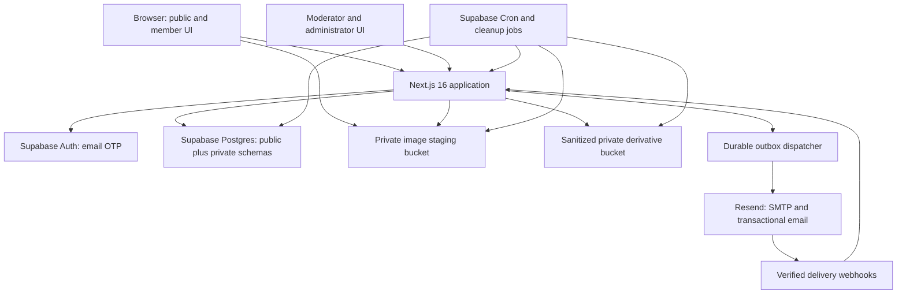
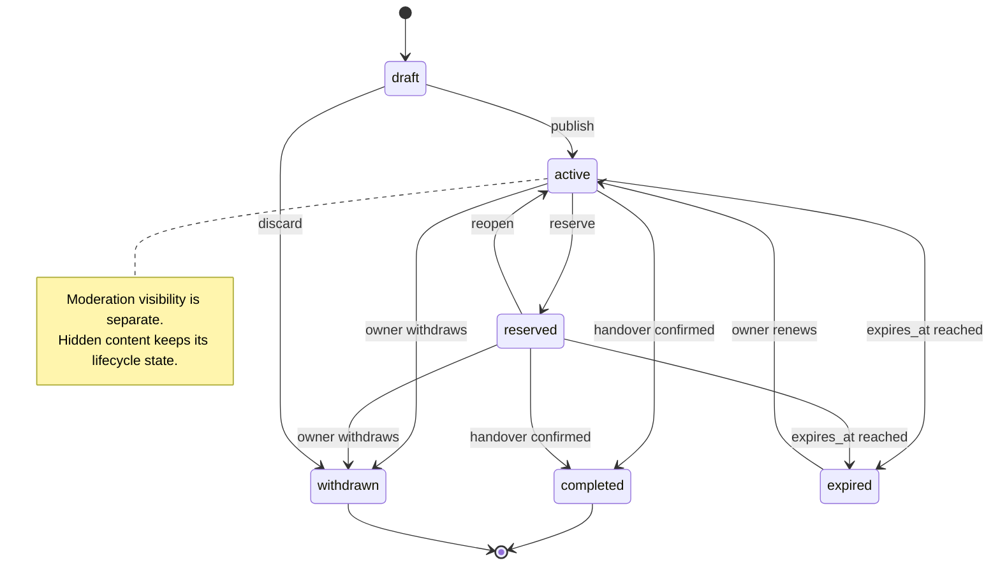
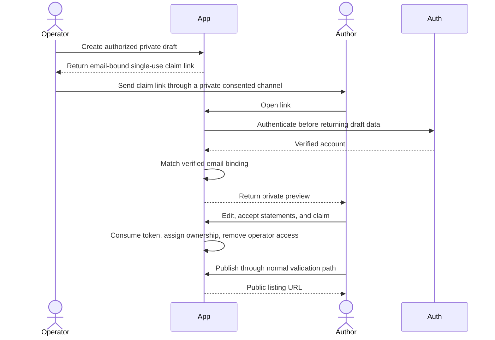
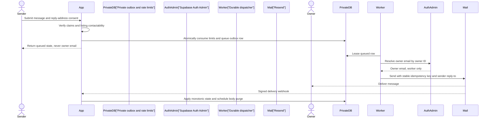

# Cross-Group Student Handover Marketplace - Plan

## Goal Capsule

- **Objective:** Build a searchable handover marketplace that consolidates housing and household-item listings now fragmented across WhatsApp and Facebook groups.
- **Primary users:** People leaving a city who offer a room or item, and people arriving who need those resources. Registration is open to any reachable email address.
- **Authority order:** The confirmed Product Contract in this plan overrides the Valencia/MERCURI reference draft. Current official framework and security guidance overrides obsolete implementation detail in that draft.
- **Execution profile:** Deep greenfield implementation with authentication, user-generated content, private contact data, email delivery, database authorization, moderation, and privacy risk.
- **Stop conditions:** Do not launch publicly without a verified sending domain, production SMTP, a named moderation owner, an approved retention schedule, a documented GDPR/DSA risk review, and passing authorization and email-leakage tests.
- **Tail ownership:** Implementation owns migrations, automated tests, operational documentation, staging verification, and the launch checklist. Legal classification and moderation staffing remain named production prerequisites.

---

## Product Contract

### Summary

This plan builds a multi-city information board where users convert fragmented group posts into structured, current, searchable housing and item listings. City and organization tags describe where a listing belongs, while resource tags describe what is offered; verified email provides a protected communication channel rather than student identity proof.

### Problem Frame

Useful Erasmus and international-community information is often trapped in separate WhatsApp and Facebook groups. A newcomer must join the right groups, scan repeated messages, interpret inconsistent formats, and verify whether an offer is still available. A person leaving the city repeats the same post across groups and manually answers stale inquiries.

The product should reduce this search and coordination cost without turning private group content into an unconsented public dataset. It should normalize location, community, resource type, availability, and expiry while preserving the original author's control over publication and contact.

### Actors

- A1. **Visitor:** Browses public, current listings and filters without an account.
- A2. **Verified member:** Controls a confirmed email address and can publish, request tags, report content, and contact listing owners.
- A3. **Listing owner:** A verified member who owns, edits, completes, withdraws, or renews a listing.
- A4. **Operator:** Helps communities submit structured drafts but cannot publish another person's content without that person's claim and confirmation.
- A5. **Moderator:** Reviews reports, illegal-content notices, taxonomy requests, and urgent safety cases through auditable actions.
- A6. **Administrator:** Manages protected roles, deployment configuration, retention jobs, and controlled taxonomy records.

### Requirements

#### Discovery and taxonomy

- R1. Visitors can browse public listings across all active cities without creating an account.
- R2. Visitors can combine one city, zero or more organizations, resource kind, subtype, price, availability, and status filters, with the selected state preserved in the URL.
- R3. Every listing has exactly one controlled city, zero or more controlled organization tags, one resource kind, and one kind-compatible subtype.
- R4. Verified members can request a missing city or organization, while only moderators can approve, reject, activate, or retire standard tags. Merge and alias tooling is deferred until real duplicate patterns establish its rules.

#### Accounts and communication

- R5. Email OTP registration and login establish control of an email address and never claim student, organization, housing, or seller verification.
- R6. Only verified members can publish a listing or submit a contact request.
- R7. A contact request sends the owner's hidden email a message and the sender's verified reply address after explicit sender consent; it never returns the owner's raw email to the browser.
- R8. Authentication, publishing, contact, tag-request, and report actions have independent IP and account-level abuse limits with non-enumerating errors and server-verified adaptive CAPTCHA after defined risk thresholds.

#### Listings and lifecycle

- R9. All listings share title, description, city, organization tags, price, currency, approximate area, availability, expiry, ownership, source, and lifecycle fields.
- R10. Housing listings use housing-specific fields and warnings, prohibit exact public addresses, and require confirmation of publication rights and permission to offer the handover lead.
- R11. Item listings use item category, condition, quantity, pickup area, and sale-or-giveaway fields; a zero price represents a giveaway rather than a separate top-level kind.
- R12. Owners can save drafts, publish, edit, reserve, complete, withdraw, renew, and delete their listings without mixing lifecycle state with resource type or moderation visibility.
- R13. Public queries exclude non-visible and expired listings at query time; scheduled jobs materialize expiry and cleanup but are not the visibility safeguard.
- R14. Listing images are sanitized before publication, contain no original metadata or file names, remain in private derivative storage, and are delivered only through visibility-checked short-lived URLs with a documented maximum revocation window.

#### Authorized group-information intake

- R15. Group information enters through original-author self-submission or an operator-assisted private draft; automated WhatsApp or Facebook scraping is outside the product. Publication produces a copyable group-ready text summary, public URL, and sanitized preview through native share or clipboard controls without reading group data or using platform APIs.
- R16. An operator-assisted draft remains private until the original author signs in, reviews the structured content, accepts the publication and safety statements, claims ownership, and publishes it.
- R17. Assisted-intake records retain only the minimum source and consent evidence needed for audit, withdrawal, expiry, and dispute handling; group invitations, member lists, and screenshots remain private and are not republished.

#### Safety, moderation, and privacy

- R18. Each listing exposes a member report flow and a separate illegal-content notice flow that remains available without login.
- R19. Moderation decisions record the report, evidence reference, rule or legal basis, actor, action, reason, time, notification state, reversal, and appeal linkage without overwriting history.
- R20. Reporters receive acknowledgment and outcome notices, while affected owners receive a reasoned decision and a review or appeal path when content or account access is restricted.
- R21. Public pages, APIs, HTML, RSC payloads, structured data, logs, caches, search indexes, client bundles, and user-authored public text contain no raw account email, phone number, private-group invitation, secret key, verification token, exact housing address, or private moderation evidence.
- R22. Account, listing, contact, assisted-intake, image, and moderation data follow a documented purpose, access role, retention period, export path, deletion path, and legal-hold exception where applicable.
- R23. Database grants, RLS policies, private schemas, storage policies, server-side authorization, and administrator checks enforce access even when the interface is bypassed.

#### Experience and measurement

- R24. Core browsing, authentication, publishing, filtering, contact, reporting, and administration flows meet WCAG 2.2 AA and work on mobile and keyboard-only navigation.
- R25. The product records privacy-preserving events for listing publication, unique contact requests, completion, expiry, reports, and moderation outcomes so success is measured by useful handovers rather than registrations alone.

### Key Decisions

- **Build the product directly.** `(session-settled: user-directed — chosen over a validation-first prerequisite: the user explicitly wants to proceed with the website now.)` Governs R1-R25.
- **Use two independent tag families.** `(session-settled: user-directed — chosen over one flat tag pool: city and organization describe context, while housing and item tags describe the resource.)` Governs R2-R4 and R9-R11.
- **Support housing and items in the first product.** `(session-settled: user-directed — chosen over a single-category MVP: both resource types are required, with different fields and safety prompts.)` Governs R9-R14.
- **Treat email verification as contactability only.** `(session-settled: user-directed — chosen over student-only identity verification: registration exists to provide a reliable communication channel and is not restricted to students.)` Governs R5-R8 and R21.
- **Allow selectable cities and organizations.** `(session-settled: user-directed — chosen over a Valencia/MERCURI-bound deployment: the old draft is reference material and users choose the relevant city and organization tags.)` Governs R1-R4.

### Key Flows

- F1. **Browse and narrow**
  - **Trigger:** A1 opens the marketplace or a shared filtered URL.
  - **Actors:** A1, A2
  - **Steps:** Load current public listings; choose city and optional organizations; choose housing or item subtype; apply or clear filters; open a listing.
  - **Outcome:** The URL represents the chosen filter state and no expired or hidden listing appears.
  - **Covered by:** R1-R4, R13, R24
- F2. **Verify email and return to intent**
  - **Trigger:** A1 attempts to publish, contact, request a tag, or submit a member report.
  - **Actors:** A1, A2
  - **Steps:** Enter email; receive OTP; verify; return to the interrupted action with non-sensitive form state preserved.
  - **Outcome:** The user gains member capabilities without any student-verification claim.
  - **Covered by:** R5, R6, R8, R24
- F3. **Publish a housing or item listing**
  - **Trigger:** A2 starts a new listing.
  - **Actors:** A2, A3
  - **Steps:** Choose resource kind; complete the corresponding fields; select city and organizations; upload images to private staging; sanitize images; review warnings; publish.
  - **Outcome:** A current, owner-controlled listing becomes public only after kind-specific validation and image processing succeed.
  - **Covered by:** R3, R9-R14, R21, R23, R24
- F4. **Contact an owner without exposing the owner email**
  - **Trigger:** A2 submits the protected contact form on a contactable listing.
  - **Actors:** A2, A3
  - **Steps:** Confirm sender-email disclosure; validate account and listing; consume rate limit; enqueue an idempotent message; send through the transactional email provider; record delivery state.
  - **Outcome:** A3 receives the message and can reply to A2, while A3's email remains absent from the browser and public data.
  - **Covered by:** R6-R8, R21-R23, R25
- F5. **Claim an operator-assisted draft**
  - **Trigger:** A4 structures an authorized group post and gives its original author a single-use claim link.
  - **Actors:** A2, A3, A4
  - **Steps:** Keep the draft private; open claim link; verify email; review and edit; accept publication statements; claim ownership; publish or reject.
  - **Outcome:** Only the original author becomes owner and no third-party group content is public before confirmation.
  - **Covered by:** R15-R17, R21-R23
- F6. **Manage listing lifecycle**
  - **Trigger:** A3 changes availability or the system reaches expiry.
  - **Actors:** A3, A5
  - **Steps:** Reserve, complete, withdraw, renew, or delete; reject stale concurrent updates; exclude expired content immediately; materialize expiry asynchronously.
  - **Outcome:** Search results stay current and lifecycle history remains distinguishable from moderation visibility.
  - **Covered by:** R12-R14, R22, R25
- F7. **Report and moderate**
  - **Trigger:** A visitor or member identifies harmful, inaccurate, private, fraudulent, or allegedly illegal content.
  - **Actors:** A1, A2, A5, A6
  - **Steps:** Submit the correct report type; acknowledge receipt; triage urgency; record a reasoned action; notify parties; allow review or reversal; preserve an append-only audit trail.
  - **Outcome:** Harmful content can be restricted promptly without unaudited or irreversible administrator action.
  - **Covered by:** R18-R23, R25

### Acceptance Examples

- AE1. **Filtered discovery**
  - **Covers:** R1-R4, R13
  - **Given:** Active housing and item listings exist in two cities and three organizations, with one listing already expired.
  - **When:** A visitor selects one city, two organizations, and the bicycle subtype.
  - **Then:** Only current bicycle listings matching that city and either selected organization appear, and reloading the URL preserves the filter.
- AE2. **Verification is not identity certification**
  - **Covers:** R5, R6
  - **Given:** A user completes email OTP login with a non-university address.
  - **When:** The user opens account and listing screens.
  - **Then:** The product shows “Email verified” semantics and allows member actions without student or organization badges.
- AE3. **Housing and item separation**
  - **Covers:** R9-R11
  - **Given:** A verified member switches a draft from housing to item.
  - **When:** The member submits the form.
  - **Then:** Housing-only fields and acknowledgments are removed from validation and persistence, while item fields become required.
- AE4. **Protected contact relay**
  - **Covers:** R7, R8, R21
  - **Given:** A verified member views an active listing and consents to share their reply address.
  - **When:** The member sends a contact message twice after a network retry.
  - **Then:** The owner receives at most one email for the idempotency window, the sender can see delivery status, and no response contains the owner email.
- AE5. **Non-contactable content**
  - **Covers:** R7, R13, R23
  - **Given:** A listing is expired, withdrawn, hidden, deleted, or owned by a suspended account.
  - **When:** A member calls the contact endpoint directly.
  - **Then:** The request is rejected without revealing which private condition applied and without sending email.
- AE6. **Authorized assisted intake**
  - **Covers:** R15-R17
  - **Given:** An operator has created a private assisted draft and sent the claim link to the original author.
  - **When:** The author verifies email, reviews, claims, and publishes the draft.
  - **Then:** Ownership transfers to the author, the operator cannot edit the published listing, and the public view contains no private group link or screenshot.
- AE7. **Expired or stolen claim link**
  - **Covers:** R16, R17, R23
  - **Given:** A claim token is expired, already used, rejected, or revoked.
  - **When:** Any signed-in user tries to claim it.
  - **Then:** No ownership or public content changes, and the attempt is recorded without storing the raw token.
- AE8. **Sanitized images**
  - **Covers:** R14, R21
  - **Given:** A member uploads a photo containing GPS EXIF and an original file name with personal information.
  - **When:** Processing succeeds and the listing is published.
  - **Then:** The sanitized derivative has no metadata or original name, remains private, and is delivered only through a fresh visibility-checked authorization; the unprocessed object remains private until cleanup.
- AE9. **Reasoned moderation**
  - **Covers:** R18-R20
  - **Given:** An anonymous person submits a sufficiently detailed illegal-content notice.
  - **When:** A moderator hides the listing and a second moderator later reverses the decision.
  - **Then:** Both decisions, reasons, notifications, and reversal remain visible in the audit history, while the reporter and owner receive the appropriate notices.
- AE10. **Taxonomy retirement**
  - **Covers:** R3, R4
  - **Given:** An organization tag is retired after listings already use it.
  - **When:** A member edits an old listing or creates a new listing.
  - **Then:** Historical listings retain a readable label, but no new publication can add the retired tag.

### Success Metrics

- **Pilot concentration:** The product remains multi-city by design, but first general traffic targets one named city and one to three partner organizations. Before opening that cohort, a named supply lead must show at least 20 distinct participating owners and 30 current author-confirmed listings, including at least 10 housing and 15 item listings; this is a launch-readiness gate, not a claim that outcome success thresholds are already settled.
- **Information utility:** Median time from publication to first unique qualified contact; seven-day contact rate; fourteen-day owner-confirmed handover rate; completion rate split by housing and item subtype.
- **Aggregation coverage:** Active cities, organizations contributing current listings, percentage of listings using approved tags, duplicate-listing rate, and assisted-draft claim rate.
- **Freshness:** Percentage of default results that are actually expired; renewal rate; time from owner completion to public removal.
- **Safety:** Reports per hundred listings, high-risk response time, contact-abuse complaints, moderation reversal rate, and unauthorized-repost complaints.
- **Effort reduction:** Search-to-contact conversion, repeat publisher rate, and qualitative feedback on whether the site replaced scanning multiple groups.
- Registration count and page views remain diagnostic metrics, not success criteria by themselves.

### Scope Boundaries

#### Included now

- Multi-city public browsing with controlled city and organization tags.
- Housing and item listings with separate subtypes, fields, validation, and safety text.
- Email OTP accounts, protected email relay, listing lifecycle, expiry, images, tag requests, authorized assisted drafts, reports, notices, moderation, and launch operations.

#### Deferred to Follow-Up Work

- Saved searches, email reminders, favorites, ratings, recommendations, maps, translations, organization-managed spaces, richer analytics, and native mobile applications.
- Automatic duplicate detection beyond exact or near-exact operational review.
- Any official-platform WhatsApp or Facebook integration requires a separate feasibility and consent review before planning.

#### Outside this product's identity

- Automated scraping of private groups or republishing without original-author confirmation.
- Student, school, landlord, ownership, tenancy, seller, item, or housing verification claims.
- Payments, deposits, escrow, contracts, guarantees, insurance, dispute settlement, or platform participation in the underlying transaction.
- Public exact addresses, public account emails, private group invitations, group member lists, or original private-group screenshots.
- Tourist accommodation, short-stay booking, and professional property-broker workflows in the initial product.

---

## Planning Contract

### Key Technical Decisions

- KTD1. **Use a patched LTS web stack.** Start with Node.js 24 and the latest security-patched Next.js 16 release available on implementation day, then commit the npm lockfile. Next.js 16 uses asynchronous request APIs and `proxy.ts`; CI must run lint separately because `next build` no longer does so.
- KTD2. **Use a server-first Next.js boundary.** Render public reads with Server Components, keep Client Components limited to interactive form and upload state, create Supabase clients per request, and authorize every Server Action or Route Handler independently of navigation or Proxy redirects.
- KTD3. **Use normalized controlled taxonomies.** Store exactly one `city_id` on each listing, zero-to-many organizations through a join table, and one subtype whose catalog is constrained by listing kind. Retired tags remain readable on historical listings but cannot be newly assigned.
- KTD4. **Separate user-scoped and privileged data access.** Browser and ordinary server requests use the publishable key, caller session, explicit grants, RLS, and a shared active-member guard for every member mutation. The secret/Admin client is limited to narrow Auth Admin, worker, role-lifecycle, and operational adapters after actor-and-resource authorization. A versioned, per-environment secret inventory separates Supabase, SMTP, Resend API, webhook, CAPTCHA, monitoring, and assisted-claim HMAC credentials; rotation and revocation are rehearsed without key reuse.
- KTD5. **Use email OTP and one verified mail provider.** Use Supabase Auth OTP, `@supabase/ssr`, and Resend for Supabase SMTP plus transactional messages. A verified sending domain is an environment prerequisite, and OTP status is derived only from Supabase Auth confirmation data.
- KTD6. **Use one durable notification outbox instead of request-bound sending.** Contact submission first obtains a short-lived nonce bound to sender, listing, and normalized payload, then atomically consumes limits and commits one typed outbox row. Supabase Cron calls a secret-protected Vercel dispatcher route every minute; the route leases bounded batches for contact and moderation templates, sends with stable provider idempotency keys, and exposes queued, delayed, delivered, bounced, and terminal states. Replay-safe webhooks apply only monotonic transitions.
- KTD7. **Bind assisted claims to a consented author email.** Operators create non-public drafts and privately deliver single-use claim invitations bound to the expected normalized-email HMAC. Authentication occurs before any preview is returned; claim consumption, email match, ownership transfer, and operator-access removal are one transaction. This rejects bearer-token possession as sufficient authorship proof.
- KTD8. **Separate lifecycle, moderation visibility, and contactability.** Lifecycle is `draft | active | reserved | completed | expired | withdrawn`; moderation restriction is an append-only action with a transactional current-state projection. A shared public-visibility predicate permits visible, unexpired active and reserved listings, while a stricter contactability predicate permits only visible, unexpired active listings. Every page, feed, count, structured-data projection, and contact route uses these predicates; shared cache lifetime never outlives the nearest expiry.
- KTD9. **Use immutable, digest-bound private media.** The browser receives a one-time owner/listing-scoped upload authorization for a non-overwritable private object. A Node image processor leases the recorded version, enforces resource budgets, re-encodes it, and writes a random-named private derivative bound to the digest. A visibility-checked media route issues short-lived access URLs; new authorization stops immediately after ineligibility and cached access must expire within the approved revocation SLA.
- KTD10. **Build transactional moderation and durable side effects into the first release.** Each moderation action appends immutable history, updates the effective restriction projection, and queues versioned cache-invalidation and notification records in one transaction. Retrying post-commit workers process those records; public reads fail closed while invalidation is pending. Reports, notices, notifications, reversal/appeal linkage, export, deletion, and retention remain launch features.
- KTD11. **Bind every cookie-authenticated mutation to user intent.** Protected mutations are POST-only, validate Origin and Host, apply framework-appropriate CSRF protection, and rotate session state after OTP. Interrupted private form state is stored server-side behind a short-lived, single-use nonce bound to the initiating browser rather than in return URLs, logs, analytics, or persistent browser storage.
- KTD12. **Make deletion a versioned tombstone transition.** Image processors, outbox dispatchers, claim handlers, webhooks, cache refreshes, moderation actions, and cleanup jobs check the current entity version and tombstone before applying effects. Post-deletion callbacks may append minimum audit evidence but cannot recreate content, ownership, delivery, or public cache entries.

### High-Level Technical Design

#### Component topology



#### Listing lifecycle and moderation visibility



#### Operator-assisted publication



#### Protected contact relay



### Output Structure

```text
package.json
package-lock.json
.node-version
.env.example
next.config.ts
proxy.ts
.github/workflows/ci.yml
src/app/(public)/page.tsx
src/app/(public)/listings/[id]/page.tsx
src/app/(public)/safety/page.tsx
src/app/(public)/privacy/page.tsx
src/app/(public)/terms/page.tsx
src/app/(auth)/login/page.tsx
src/app/(member)/listings/new/page.tsx
src/app/(member)/listings/[id]/edit/page.tsx
src/app/(member)/dashboard/page.tsx
src/app/(member)/assisted/[token]/page.tsx
src/app/admin/taxonomy/page.tsx
src/app/admin/reports/page.tsx
src/app/api/listings/[id]/contact/route.ts
src/app/api/listings/[id]/images/process/route.ts
src/app/api/assisted-listings/route.ts
src/app/api/assisted-listings/[token]/claim/route.ts
src/app/api/reports/route.ts
src/app/api/notices/route.ts
src/app/api/tag-requests/route.ts
src/app/api/webhooks/resend/route.ts
src/components/listings/listing-form.tsx
src/components/listings/housing-fields.tsx
src/components/listings/item-fields.tsx
src/components/taxonomy/city-select.tsx
src/components/taxonomy/organization-select.tsx
src/components/safety/housing-warning.tsx
src/lib/auth/require-user.ts
src/lib/email/resend.ts
src/lib/listings/schema.ts
src/lib/listings/queries.ts
src/lib/taxonomy/schema.ts
src/lib/moderation/schema.ts
src/lib/supabase/client.ts
src/lib/supabase/server.ts
src/lib/supabase/admin.ts
supabase/config.toml
supabase/seed.sql
supabase/migrations/
supabase/tests/database/
tests/unit/
tests/e2e/
docs/product/mvp-scope.md
docs/operations/moderation-runbook.md
docs/operations/data-retention.md
docs/operations/launch-checklist.md
```

### Sequencing

1. Establish supported runtimes, environment separation, tests, and real email delivery before building flows that depend on them.
2. Land taxonomy, listing schemas, grants, RLS, roles, and private-data boundaries before public or member pages.
3. Add authentication, then authoring and media, then discovery and lifecycle.
4. Add contact relay only after authorization and transactional email are testable end to end.
5. Add assisted intake after the normal owner publication path exists so it cannot become a privileged bypass.
6. Add moderation and operational hardening before public launch, then run the complete verification contract.

### System-Wide Impact

- **Data lifecycle:** Listing state, media, contact outbox, claim tokens, reports, and audit evidence have different retention and deletion rules; deletion must coordinate Postgres, Auth, Storage, caches, and email-provider data.
- **Authorization:** Proxy refresh improves navigation but never replaces route-level authorization, database RLS, private schemas, or server-only secret handling.
- **Email:** One provider supports Auth SMTP and application relay, so provider outage, domain reputation, bounces, webhook replay, and idempotency affect both access and communication.
- **Taxonomy:** Controlled tags improve search quality but create moderation work for duplicates, aliases, inactive organizations, and city-organization mismatches.
- **Operations:** Multi-city availability does not remove local-law and supply-density differences; safety resources and organization labels must not imply endorsement.

### Risks and Dependencies

| Risk or dependency | Impact | Planned treatment |
|---|---|---|
| Verified domain, DNS, and Resend configuration | Users cannot receive OTP or contact messages | Make staging email delivery a prerequisite in U1 and test bounce/webhook behavior before U6 |
| Supabase SSR beta behavior or API-key transition | Session regressions or leaked privilege | Lock implementation-day versions, use new publishable/secret keys, and run session-refresh and client-bundle tests |
| RLS or grant error | Cross-user writes or private-data exposure | Write role-matrix pgTAP tests before feature pages and keep sensitive tables outside exposed schemas |
| Unauthorized group reposting | Privacy, copyright, and trust harm | Require self-submission or private assisted claim; prohibit direct operator publication and scraping |
| Housing fraud or illegal handover | Financial or legal harm | Show persistent warnings, collect permission acknowledgment, prohibit platform payment/guarantee claims, and provide urgent reporting |
| Empty or diluted city feeds | Users still scan groups because the site lacks density | Measure current listings and handover outcomes by city and organization; retire inactive tags without hiding historical context |
| Email or contact abuse | Harassment, enumeration, or inbox bombing | Apply layered rate limits, non-enumerating errors, CAPTCHA escalation, idempotency, suspension, and audit logs |
| Privileged client used as a confused deputy | A normal feature route can bypass ownership or expose private data | Confine Admin access to named, purpose-specific adapters; ban direct imports with static tests; authorize the actor and target inside every adapter; audit each privileged mutation |
| Provider ambiguity or duplicate delivery | A retry sends the same contact message twice, or a silent failure loses it | Persist intent in a durable outbox, lease jobs, use stable idempotency keys, process signed events monotonically, expose terminal failures, and keep a provider kill switch |
| Image metadata or active content | Exact-location leakage or file-upload compromise | Use private staging, actual-content validation, server re-encoding, random names, and cleanup tests |
| Moderation capacity or legal classification unclear | Unsafe launch or unmet notice obligations | Make named owner, SLA, DSA/GDPR risk review, retention approval, and escalation contacts launch blockers |
| Cron beta or job failure | Stale state or undeleted data | Enforce expiry in reads, make jobs idempotent, monitor history, and test replay/concurrency |
| Asynchronous work races with deletion | A worker, webhook, cache regeneration, or moderation reversal recreates deleted data | Use versioned tombstones checked by every asynchronous path, make deletion monotonic, and run orphan/reconciliation alerts |
| Migration, rollback, or environment drift | Production loses rows, holds locks, or points at staging/prohibited regions | Rehearse the complete migration chain and PITR restore on representative data, classify rollback behavior, verify exact production IDs and regions, and stop launch on any drift or unexplained loss |

---

## Implementation Units

### U1. Project foundation and environment contract

- **Goal:** Establish the supported Next.js, Node, Supabase, Resend, testing, and deployment baseline.
- **Requirements:** Enables R5-R8, R21-R25.
- **Dependencies:** None.
- **Files:** `package.json`, `package-lock.json`, `.node-version`, `.env.example`, `next.config.ts`, `proxy.ts`, `src/app/layout.tsx`, `src/lib/env.ts`, `src/lib/secrets/inventory.ts`, `src/lib/supabase/client.ts`, `src/lib/supabase/server.ts`, `src/lib/supabase/admin.ts`, `sentry.client.config.ts`, `sentry.server.config.ts`, `vitest.config.ts`, `playwright.config.ts`, `supabase/config.toml`, `.github/workflows/ci.yml`, `tests/unit/env.test.ts`, `tests/unit/privileged-boundary.test.ts`, `tests/unit/secret-rotation.test.ts`.
- **Approach:** Deliver two checkpoints inside U1. **U1a local foundation** locks Node/Next.js, validates environment and purpose-separated secrets, creates request-scoped clients, configures Supabase and CI, and selects Sentry with email escalation for application telemetry while retaining Supabase job history. **U1b provider readiness** configures staging/production isolation, regions, verified Resend DNS/SMTP, redirects, monitoring delivery, and backup evidence. Define independent lint, type, unit, database, E2E, accessibility, build, and alert-smoke scripts.
- **Execution note:** U2 may begin after U1a. U1b runs in parallel and gates U3/U6 staging verification and production launch, not local schema work.
- **Patterns to follow:** KTD1, KTD2, KTD4, KTD5; the route grouping proposed in `.hermes/plans/2026-08-03_174806-erasmus-handover-mvp-review.md`.
- **Test scenarios:**
  - Missing public Supabase URL, publishable key, server secret, Resend key, webhook secret, or application URL fails startup with a variable-specific server-side error and never echoes the secret value.
  - Importing a server-only module from a Client Component fails the build boundary check.
  - Only approved Auth Admin, outbox, image-worker, moderation, and retention adapters can import the privileged client; feature routes cannot issue unrestricted Admin queries.
  - A preview deployment uses staging resources and cannot read or write production data.
  - OTP delivery through staging SMTP succeeds, while an intentional provider failure produces a retryable user state without exposing account existence.
  - CI runs lint and type checking independently of the production build.
- **Verification:** A fresh checkout can install, reset local Supabase, run the baseline checks, and deploy a non-production smoke page without production credentials.

### U2. Taxonomy, listing schema, grants, and RLS

- **Goal:** Create the normalized data model and database-enforced ownership and visibility rules.
- **Requirements:** R1-R4, R9-R13, R21-R23.
- **Dependencies:** U1a local-foundation checkpoint; U1b may remain in parallel.
- **Files:** `supabase/migrations/202608070001_core_taxonomy_and_listings.sql`, `supabase/migrations/202608070002_private_schemas_roles_and_rls.sql`, `supabase/seed.sql`, `src/lib/taxonomy/schema.ts`, `src/lib/taxonomy/queries.ts`, `src/lib/listings/schema.ts`, `supabase/tests/database/taxonomy.test.sql`, `supabase/tests/database/rls.test.sql`, `supabase/tests/database/lifecycle.test.sql`, `tests/unit/taxonomy-schema.test.ts`, `tests/unit/listing-schema.test.ts`.
- **Approach:** Create `profiles`, `cities`, `organizations`, `resource_categories`, `listings`, `listing_organizations`, `housing_details`, `item_details`, and `listing_images`; keep sensitive roles and operational tables in a private schema; give each city an IANA timezone; constrain subtype-kind compatibility and organization-city compatibility; write explicit grants, RLS policies, indexes, and transition constraints.
- **Execution note:** Start with failing database role-matrix and lifecycle tests before exposing any table to UI code.
- **Patterns to follow:** KTD3, KTD4, KTD8; Supabase migration, RLS, Storage ownership, and database-test guidance cited in Sources and Research.
- **Test scenarios:**
  - Anonymous users read only visible, active or reserved, unexpired listings and their approved public relations.
  - Owners read and mutate their own drafts and historical listings; non-owners cannot do so even through direct Data API calls.
  - A listing accepts exactly one active city, rejects a housing subtype on an item, and rejects a city-scoped organization from another city.
  - Multiple organizations can be attached once each, while duplicate join rows fail.
  - Retiring a tag blocks new assignment but preserves historical display.
  - Public roles cannot access private roles, rate limits, assisted-intake evidence, contact outbox, reports, or moderation tables.
  - Expiry boundary tests at one instant before, exactly at, and after `expires_at` produce the intended public visibility.
- **Verification:** A database reset applies every migration and seed in order, all database tests pass for anon, owner, non-owner, moderator, and server roles, and no sensitive table is exposed to public API roles.

### U3. Email OTP accounts and authorization guards

- **Goal:** Provide contactability-based registration and reusable member, owner, moderator, and administrator authorization.
- **Requirements:** R5, R6, R8, R21-R24.
- **Dependencies:** U1, U2.
- **Files:** `src/app/(auth)/login/page.tsx`, `src/app/auth/confirm/page.tsx`, `src/app/(member)/account/page.tsx`, `src/lib/auth/require-user.ts`, `src/lib/auth/require-active-member.ts`, `src/lib/auth/require-role.ts`, `src/lib/auth/return-to.ts`, `src/lib/auth/intent.ts`, `src/components/auth/otp-form.tsx`, `src/components/account/email-change-form.tsx`, `src/lib/abuse/captcha.ts`, `tests/unit/return-to.test.ts`, `tests/unit/auth-intent.test.ts`, `tests/unit/captcha.test.ts`, `tests/e2e/auth.spec.ts`, `tests/e2e/account.spec.ts`, `tests/e2e/authorization.spec.ts`, `tests/e2e/csrf.spec.ts`.
- **Approach:** Implement six-digit OTP through Supabase Auth and Resend SMTP; derive verified state from Auth claims; provide an account screen for verification state and email changes; re-check claims, active-account state, and current roles in every protected operation; rotate session state after OTP; preserve interrupted intent behind a single-use browser-bound nonce; require POST, Origin/Host and CSRF validation; verify adaptive CAPTCHA server-side after risk thresholds with replay protection and a retryable provider-failure state.
- **Patterns to follow:** KTD2, KTD4, KTD5, KTD11; official Supabase SSR and Next.js authentication guidance.
- **Test scenarios:**
  - A first-time email receives an OTP, creates an account after correct entry, and returns to the intended publish or contact screen.
  - Wrong, expired, reused, or superseded OTPs fail without identifying whether an account existed before the attempt.
  - Resend cooldown and account/IP rate limits prevent email bombing and enumeration across many addresses.
  - A non-university address receives the same member capability and only “Email verified” semantics.
  - Changing email removes verified member capability until the new address is confirmed and notifies the previous address.
  - Pending email change, resend cooldown, cancellation, expired confirmation, and recovery are understandable and keyboard accessible from the account screen.
  - The shared active-member guard rejects suspended or deleted accounts on every protected mutation, including a stale authenticated session and direct route calls.
  - CAPTCHA is introduced only after the configured risk threshold; distributed-IP/account attacks, replay, timeout, and provider failure remain bounded and recoverable without silently bypassing the challenge.
  - External or malformed return URLs cannot create an open redirect.
  - Cross-origin form and fetch attempts, login-CSRF, session fixation, stolen intent nonce, replay, and cross-browser nonce use cannot execute protected mutations or reveal preserved form data.
  - Hiding a button, forging a cookie, or calling a protected route directly does not bypass server and role checks.
- **Verification:** Authentication, refresh, logout, role, return-to, SMTP-failure, and preview-callback scenarios pass without exposing tokens or secrets in logs and browser payloads.

### U4. Kind-specific authoring and sanitized media

- **Goal:** Let verified owners create and edit distinct housing and item listings with safe images and tag selection.
- **Requirements:** R3, R6, R9-R14, R21, R23, R24.
- **Dependencies:** U2, U3.
- **Files:** `supabase/migrations/202608070003_storage_buckets_and_policies.sql`, `src/app/(member)/listings/new/page.tsx`, `src/app/(member)/listings/[id]/edit/page.tsx`, `src/app/api/media/[imageId]/route.ts`, `src/components/listings/listing-form.tsx`, `src/components/listings/image-uploader.tsx`, `src/components/listings/share-kit.tsx`, `src/components/listings/housing-fields.tsx`, `src/components/listings/item-fields.tsx`, `src/components/taxonomy/city-select.tsx`, `src/components/taxonomy/organization-select.tsx`, `src/components/safety/housing-warning.tsx`, `src/app/api/listings/[id]/images/process/route.ts`, `src/lib/images/process.ts`, `src/lib/listings/public-text-policy.ts`, `tests/unit/listing-schema.test.ts`, `tests/unit/image-policy.test.ts`, `tests/unit/public-text-policy.test.ts`, `tests/e2e/publish.spec.ts`, `tests/e2e/images.spec.ts`, `tests/e2e/share-kit.spec.ts`, `tests/e2e/storage-access.spec.ts`.
- **Approach:** Use one accessible form shell and discriminated schemas; reject public free text containing contact details, private-group invitations, or exact addresses; create an owner draft before uploads; enforce direct Storage role policies; show per-image queued, uploading, processing, ready, failed, removing, replaced, and quota states; publish only after every derivative is ready; deliver private derivatives through short-lived visibility-checked URLs; generate the group-ready share kit after publication; use optimistic versioning for stale edits.
- **Patterns to follow:** KTD3, KTD4, KTD8, KTD9; OWASP file-upload and W3C form guidance.
- **Test scenarios:**
  - Covers AE3. Switching kind removes hidden fields from validation and persistence, while restoring the required fields and warnings for the new kind.
  - Housing cannot publish without approximate area, availability, permission acknowledgment, anti-fraud warning acknowledgment, and a valid housing subtype; exact street-address fields do not exist.
  - Items enforce category, condition, quantity, pickup area, and non-negative price; price zero displays as giveaway.
  - A user cannot edit, process images for, or publish another user's draft.
  - Covers AE8. GPS EXIF, original filenames, forged MIME, corrupted images, active content, excessive dimensions, and file-count limits are handled according to policy.
  - Processing failure keeps the listing private and retryable without leaving a public original.
  - Replacement or deletion during processing, duplicate processing requests, decompression bombs, account quota exhaustion, stale derivative publication, and owner deletion during processing cannot publish or resurrect media.
  - Anonymous, member, owner, and privileged direct Storage requests satisfy the full bucket and object-policy role matrix; guessing an object path or reusing an expired media authorization fails.
  - Image UI states survive refresh, announce progress and failure accessibly, and allow retry, replace, and remove without duplicating or publishing stale derivatives.
  - Public text containing raw email, phone, private-group invitations, or an exact address is rejected with accessible correction while ordinary descriptive text remains usable.
  - The post-publication share kit produces a sanitized summary, listing URL, and approved image through clipboard/native share without private fields, secret URLs, or privileged API access.
  - Two concurrent edits reject the stale version and preserve the latest committed data.
  - Form errors retain entered data, focus the summary or first invalid field, and remain understandable without color.
- **Verification:** A verified owner can create and edit both kinds on mobile and keyboard navigation, while all unauthorized, invalid, or unsanitized paths remain non-public.

### U5. Public discovery, owner dashboard, and lifecycle

- **Goal:** Provide fast structured discovery and a current owner-controlled handover lifecycle.
- **Requirements:** R1-R4, R9-R13, R24, R25.
- **Dependencies:** U5a depends on U2; U5b depends on U3, U4, and U5a.
- **Files:** `src/app/(public)/page.tsx`, `src/app/(public)/listings/[id]/page.tsx`, `src/app/(member)/dashboard/page.tsx`, `src/components/navigation/site-header.tsx`, `src/components/navigation/mobile-nav.tsx`, `src/components/listings/listing-card.tsx`, `src/components/listings/listing-filters.tsx`, `src/components/listings/mobile-filter-drawer.tsx`, `src/components/listings/lifecycle-actions.tsx`, `src/lib/listings/queries.ts`, `src/lib/listings/transitions.ts`, `tests/unit/filter-schema.test.ts`, `tests/e2e/browse.spec.ts`, `tests/e2e/navigation.spec.ts`, `tests/e2e/lifecycle.spec.ts`.
- **Approach:** Deliver **U5a public discovery** immediately after U2 using seeded housing/item fixtures: server-rendered typed URL filters, deterministic pagination, separate context/resource tags, and a responsive filter drawer with Apply, Clear, active-filter summary, result-count announcement, focus restoration, and no-JavaScript submission. Deliver **U5b owner lifecycle** after U3/U4: a responsive global navigation and dashboard with guarded reserve, reopen, complete, withdraw, renew, and delete actions; each action defines confirmation, pending, stale-version recovery, feedback, reversibility, expiry selection, and post-delete destination. Use versioned cache keys and durable invalidation records rather than assuming synchronous external cache invalidation.
- **Patterns to follow:** KTD2, KTD3, KTD8; F1 and F6.
- **Test scenarios:**
  - Covers AE1. Combined filters, pagination, shared URLs, reload, back navigation, clear-all, result counts, and empty states preserve correct behavior.
  - U5a runs against seeded housing and item fixtures before authoring is ready, proving that public discovery can ship and be evaluated independently.
  - The mobile filter drawer applies or clears filters only through explicit controls, serializes the same URL state as desktop, restores focus, announces result counts, and remains usable without JavaScript.
  - Visitor, member, moderator, and administrator navigation exposes only appropriate destinations, remains keyboard accessible at supported breakpoints, and updates safely after a role change.
  - Organization selection is limited to the chosen city plus approved global organizations, while a retired organization remains readable on an old listing.
  - Public result cards distinguish housing, item, giveaway, reserved, city, and organization without relying on color alone.
  - Anonymous detail pages contain no private email, exact address, draft field, private source evidence, or moderation data in HTML, RSC, JSON-LD, or cached output.
  - Covers F6. Reserve, reopen, complete, withdraw, renew, delete, and forbidden transitions produce the intended state and history.
  - Every lifecycle action covers confirmation, pending and duplicate-submission states, stale-version recovery, success/error feedback, reversibility, and the documented post-delete destination.
  - A listing that expires between page load and action disappears from public queries and cannot be contacted even if the cron job has not run.
  - Search result and listing caches stop serving hidden, withdrawn, completed, deleted, or expired content after state change.
  - Reserved listings remain readable but the shared contactability predicate blocks new contact requests from every route and stale page.
- **Verification:** Public discovery and owner lifecycle work across mobile, keyboard, direct URLs, stale data, and empty or error states, with freshness enforced independently of scheduled jobs.

### U6. Protected contact relay and abuse controls

- **Goal:** Enable useful email communication without exposing listing-owner addresses or enabling bulk abuse.
- **Requirements:** R5-R8, R13, R21-R23, R25.
- **Dependencies:** U1b provider-readiness checkpoint, U2, U3, U5a public discovery.
- **Files:** `supabase/migrations/202608070004_contact_outbox_and_rate_limits.sql`, `src/app/api/contact-intents/route.ts`, `src/app/api/listings/[id]/contact/route.ts`, `src/app/api/internal/dispatch-email/route.ts`, `src/app/api/contact-status/[intentId]/route.ts`, `src/app/api/webhooks/resend/route.ts`, `src/components/contact/contact-form.tsx`, `src/components/contact/contact-status.tsx`, `src/lib/email/outbox.ts`, `src/lib/email/dispatcher.ts`, `src/lib/email/resend.ts`, `src/lib/email/templates/contact.tsx`, `src/lib/rate-limit/consume.ts`, `tests/unit/contact-policy.test.ts`, `tests/unit/outbox-state.test.ts`, `tests/e2e/contact.spec.ts`, `tests/e2e/contact-status.spec.ts`, `tests/e2e/dispatcher.spec.ts`, `tests/e2e/resend-webhook.spec.ts`, `supabase/tests/database/contact.test.sql`.
- **Approach:** Issue a short-lived sender/listing/payload-bound intent nonce; authenticate, require consent, verify adaptive CAPTCHA when challenged, consume independent quotas, and queue one unique typed outbox row. Supabase Cron invokes the protected dispatcher route every minute; workers lease bounded batches with stable provider keys. The sender sees queued, sending, delayed, delivered, bounced, and terminal states with accessible announcements. Resolve owner email only inside the dispatcher, apply verified events monotonically, and purge bodies on schedule.
- **Execution note:** Start with failing leakage and duplicate-delivery tests before integrating the provider.
- **Patterns to follow:** KTD4-KTD6; F4; Resend SMTP, API, idempotency, and webhook documentation.
- **Test scenarios:**
  - Covers AE4. A network retry and repeated submit use one idempotency record and do not deliver duplicate email.
  - A request-stable intent binds the sender, listing, normalized payload, and expiry; payload substitution and replay fail, while a genuinely new later message can obtain a new intent.
  - Covers AE5. Anonymous, unverified, suspended, owner-self-contact, expired, hidden, completed, withdrawn, and deleted cases send nothing and reveal no private condition.
  - The delivered email contains listing context, sanitized message content, and the consenting sender's reply address, but browser responses and logs never contain the owner email.
  - Forged or replayed Resend webhooks do not update delivery state; valid duplicate events are idempotent.
  - Provider timeout, rate limit, bounce, and permanent failure create retryable or terminal states without losing auditability.
  - The sender status interface progresses monotonically from queued through delivered, bounced, suppressed, or terminal failure, survives refresh, and announces changes accessibly without claiming delivery for nondelivery states.
  - Supabase Cron can call only the authenticated internal dispatcher at the documented cadence; invalid, staging, replayed, or rotated scheduler credentials fail and missed runs are observable and recoverable.
  - Crash before send, provider acceptance followed by response loss, concurrent workers, stale leases, webhook-before-response, reordered events, and duplicate events cannot send twice or regress delivery state.
  - Sender/listing ID substitution and unrestricted Admin-client use fail before any privileged email lookup.
  - One IP targeting many accounts and one account contacting many listings trigger their separate limits; normal retries remain usable.
  - Contact message bodies are removed on schedule while aggregate contact metrics remain correct.
- **Verification:** End-to-end contact works in staging with real mail delivery, and automated leakage scans find no owner email or secret in public APIs, HTML, RSC, browser bundles, logs, or caches.

### U7. Authorized operator-assisted intake

- **Goal:** Turn group information into structured private drafts without unconsented publication or privileged operator bypasses.
- **Requirements:** R15-R17, R21-R24.
- **Dependencies:** U2-U5.
- **Files:** `supabase/migrations/202608070005_assisted_intake.sql`, `src/app/(member)/assisted/[token]/page.tsx`, `src/app/api/assisted-listings/route.ts`, `src/app/api/assisted-listings/[token]/claim/route.ts`, `src/components/assisted/claim-review.tsx`, `src/lib/assisted/tokens.ts`, `tests/unit/claim-token.test.ts`, `tests/e2e/assisted-intake.spec.ts`, `supabase/tests/database/assisted-intake.test.sql`.
- **Approach:** Restrict draft creation to operators; require an authorization attestation, minimal source label, and the author's consented normalized-email HMAC; privately deliver a high-entropy single-use token stored only as a hash; authenticate and match the email before returning preview data; let the authenticated author either claim or reject the draft; on rejection, confirm the consequence, atomically consume the invitation and remove the draft under the retention policy while keeping only the minimum audit evidence and a terminal confirmation; on claim, transfer ownership, consume the token, and remove operator access atomically; expire or revoke unclaimed drafts; never store a group member list or publish a source screenshot or invitation.
- **Execution note:** Reuse the owner publication path from U4 and fail the work if operator code can publish directly.
- **Patterns to follow:** KTD7, F5, EU Article 14 guidance, Meta and WhatsApp terms cited in Sources and Research.
- **Test scenarios:**
  - Covers AE6. A valid original author can claim, edit, own, and publish, while the operator loses edit authority after claim.
  - Covers AE7. Expired, used, rejected, revoked, malformed, or forged tokens cannot claim or reveal draft details.
  - A user who finds a link must still verify email and explicitly accept publication; claiming and token consumption are atomic under concurrency.
  - The matched author can reject without publishing; concurrent claim/reject attempts have one terminal result, the invitation cannot be reused, the draft follows retention policy, and the author receives a clear confirmation.
  - A stolen link used by a different email, operator rebinding, email change, normalization mismatch, repeated failed claims, and concurrent valid claims cannot expose or transfer the draft.
  - An assisted draft is absent from public queries, search indexes, public Storage, and listing counts before claim and publication.
  - Operator inputs containing private group URLs, screenshots, emails, phone numbers, or exact addresses are rejected or removed from public fields.
  - Withdrawal or privacy complaint can locate the assisted source evidence, unpublish the listing, and retain only the required audit record.
- **Verification:** An authorized group post can move from private draft to owner-controlled public listing only through the same validation and safety path as self-submission, or reach a terminal author-rejected state without becoming public.

### U8. Taxonomy operations, reports, notices, and moderation

- **Goal:** Make controlled tags and user-generated content operable, reviewable, and reversible from the first release.
- **Requirements:** R4, R8, R18-R25.
- **Dependencies:** U2, U3, U5a, U6.
- **Files:** `supabase/migrations/202608070006_taxonomy_requests_and_moderation.sql`, `src/app/api/tag-requests/route.ts`, `src/app/api/reports/route.ts`, `src/app/api/notices/route.ts`, `src/app/(public)/notices/new/page.tsx`, `src/components/reports/member-report-form.tsx`, `src/components/reports/illegal-content-notice-form.tsx`, `src/components/reports/submission-receipt.tsx`, `src/app/admin/taxonomy/page.tsx`, `src/app/admin/reports/page.tsx`, `src/app/admin/roles/page.tsx`, `src/lib/moderation/schema.ts`, `src/lib/moderation/actions.ts`, `src/lib/moderation/notifications.ts`, `src/lib/roles/manage.ts`, `src/lib/cache/invalidation-outbox.ts`, `src/app/(public)/safety/page.tsx`, `src/app/(public)/privacy/page.tsx`, `src/app/(public)/terms/page.tsx`, `tests/unit/moderation-schema.test.ts`, `tests/unit/cache-invalidation.test.ts`, `tests/e2e/taxonomy-admin.spec.ts`, `tests/e2e/report.spec.ts`, `tests/e2e/moderation-notification.spec.ts`, `tests/e2e/role-management.spec.ts`, `supabase/tests/database/moderation.test.sql`.
- **Approach:** Approve, reject, activate, and retire taxonomy requests without launch-time merge/alias tooling; provide distinct listing-level member reports and anonymous illegal-content notices with validation, correction, receipt, duplicate, rate-limit, and focus states; append moderation history, update restriction projection, and queue typed notifications plus cache-invalidation records in one transaction; process side effects through U6 workers. Manage protected roles through a server-only audited adapter with recent OTP, no self-grant, no last-admin removal, documented bootstrap, and immediate revocation.
- **Patterns to follow:** KTD3, KTD4, KTD8, KTD10; F7; DSA notice-and-action and reasoned-decision guidance.
- **Test scenarios:**
  - Covers AE10. Duplicate requests, approval, rejection, activation, retirement, and city-organization compatibility preserve taxonomy integrity; merge and alias behavior remains deferred.
  - An anonymous person can submit a sufficiently detailed illegal-content notice and receive acknowledgment, while an incomplete notice receives accessible correction guidance.
  - A verified member can report fraud, spam, inaccuracy, expiry, impersonation, discrimination, privacy, or prohibited items from the listing page.
  - Member-report and anonymous-notice forms cover duplicate submission, rate limiting, validation, correction, acknowledgment receipt, and focus recovery without exposing reporter identity.
  - Covers AE9. Hide, restore, account restriction, reversal, notification, and appeal linkage append new audit entries and never overwrite prior decisions.
  - A high-risk safety report enters the urgent path and alerts the named operator rather than waiting in the normal queue.
  - A normal user, stale administrator session, or forged role cannot access reports, evidence, contact data, or moderation actions.
  - Notification provider failure is retryable and visible to moderators without repeating the moderation action.
  - Notification and cache-invalidation records are committed with the moderation decision, leased independently after commit, retried idempotently, and remain visible while pending or terminally failed.
  - Administrator bootstrap, recent-OTP grant, revocation, self-grant denial, last-admin protection, stale-role sessions, and rotated privileged credentials preserve an auditable protected-role lifecycle.
  - Concurrent hide/restore, stale moderator sessions, reversal during deletion, and notification failure preserve immutable history and one consistent effective restriction.
- **Verification:** Taxonomy and moderation queues are usable by keyboard, enforce current roles, provide complete reasoned history, and support the published operating SLA.

### U9. Expiry, retention, accessibility, and launch hardening

- **Goal:** Close data lifecycles, prove user-facing quality, and make public launch a controlled operational decision.
- **Requirements:** R8, R12-R14, R19-R25.
- **Dependencies:** U1-U8.
- **Files:** `supabase/migrations/202608070007_expiry_and_retention_jobs.sql`, `src/app/(member)/account/privacy/page.tsx`, `src/app/api/account/export/route.ts`, `src/app/api/account/delete/route.ts`, `src/lib/privacy/export.ts`, `src/lib/privacy/delete-account.ts`, `src/lib/retention/policy.ts`, `src/lib/monitoring/signals.ts`, `src/lib/monitoring/sentry.ts`, `tests/unit/retention-policy.test.ts`, `tests/e2e/account-privacy.spec.ts`, `tests/e2e/accessibility.spec.ts`, `tests/e2e/privacy-leakage.spec.ts`, `tests/e2e/mobile-smoke.spec.ts`, `tests/e2e/monitoring-smoke.spec.ts`, `docs/product/mvp-scope.md`, `docs/operations/moderation-runbook.md`, `docs/operations/data-retention.md`, `docs/operations/deployment-runbook.md`, `docs/operations/launch-checklist.md`, `docs/operations/pilot-scorecard.md`.
- **Approach:** Add idempotent expiry and cleanup jobs; coordinate authenticated export and deletion across Auth, database, Storage, outbox, caches, and retained evidence through tombstone-aware adapters; implement durable cache invalidation and image cleanup; send structured telemetry to Sentry, preserve Supabase job history, and test email escalation; rehearse migrations and restoration; define invariants, canaries, thresholds, owners and abort conditions; run accessibility, mobile, privacy, authorization, recovery, and staging checks.
- **Execution note:** Treat the launch checklist as a release gate, not documentation added after deployment.
- **Patterns to follow:** KTD8-KTD12; official GDPR privacy-by-design, retention, OWASP, W3C, Supabase Cron, and Vercel environment guidance.
- **Test scenarios:**
  - Expiry job replay, overlap, failure, and delayed execution remain idempotent and never restore expired content to public results.
  - Account deletion removes or anonymizes owned listings, private media derivatives and their authorizations, drafts, and contact data according to policy while preserving legally required moderation evidence.
  - The account privacy screen provides authenticated export and deletion requests with progress, confirmation, cancellation boundaries, partial-provider failure, retry, and a durable completion receipt.
  - Deletion raced against image processing, claims, outbox delivery, webhooks, moderation reversal, cleanup, and cache regeneration never recreates content, ownership, delivery, or public visibility.
  - Orphaned staging files, private derivatives, expired media authorizations, rejected assisted drafts, and purged contact bodies are cleaned without deleting another user's objects.
  - Privacy-leakage scans cover HTML, RSC, REST responses, structured data, client bundles, browser storage, logs, caches, and exported files.
  - Keyboard and screen-reader checks cover login, OTP, filters, kind switching, upload, contact, report, notice, taxonomy, and moderator actions; automated checks have no serious WCAG 2.2 AA failures.
  - Mobile and slow-network checks preserve form state, avoid duplicate actions, and offer understandable retry states.
  - Sentry receives a controlled application error and expected operational signals without personal message bodies; alert routing and escalation are proven with an owned canary.
  - The selected first pilot cohort has a named supply lead and recorded evidence for at least 20 participating owners and 30 current author-confirmed listings, including the housing/item minimums; missing evidence blocks general traffic without blocking multi-city development.
  - Production launch remains blocked when legal classification, retention approval, moderation owner, escalation contact, verified email domain, environment isolation, backups, or security advisory review is missing.
- **Verification:** Every applicable local and staging gate passes before promotion. Migration and restoration rehearsals pass before cutover; production-only environment, invariant, canary, monitoring, and timed-observation gates pass during the controlled launch; no abandoned experimental code or temporary bypass remains.

---

## Verification Contract

| Gate | Command or review | Applies to | Done signal |
|---|---|---|---|
| Dependency install | `npm ci` | U1-U9 | Lockfile installs without drift on Node 24 |
| Lint | `npm run lint` | U1-U9 | No lint errors; runs independently of build |
| Type safety | `npm run typecheck` | U1-U9 | Application, tests, and generated database types pass |
| Unit tests | `npm run test` | U1-U9 | Validation, transitions, tokens, contact, images, moderation, and retention tests pass |
| Database reset | `npm run db:reset` | U2, U6-U9 | Migrations and seed apply from an empty local database |
| Database security | `npm run db:test` | U2, U6-U9 | pgTAP role, RLS, taxonomy, lifecycle, contact, assisted-intake, and moderation tests pass |
| Storage security | `npm run test:storage` | U2, U4, U9 | Direct anonymous, owner, non-owner, worker, moderator, and administrator read/list/create/overwrite/move/delete checks match the bucket policy matrix |
| Browser journeys | `npm run test:e2e` | U3-U9 | Auth, publish, browse, contact, assisted, report, admin, deletion, and recovery journeys pass |
| Accessibility | `npm run test:a11y` | U3-U9 | Automated and named manual WCAG 2.2 AA checks pass |
| Production build | `npm run build` | U1-U9 | Next.js production build succeeds with no client-secret inclusion |
| Staging smoke | `npm run test:staging` | U3, U6-U9 | Real OTP, Resend delivery/webhooks, Storage, redirects, expiry, and report notifications pass against staging only |
| Security review | Dependency advisories plus Next.js, Supabase, Vercel, and Resend release notices | U1, U9 | No unresolved relevant critical or high advisory; versions remain supported |
| Operational review | `docs/operations/launch-checklist.md` | U8, U9 | Legal, privacy, moderation, retention, DNS, backups, region, and escalation prerequisites are approved |
| Production invariant audit | `docs/operations/deployment-runbook.md` | U2, U6-U9 | Every invariant below returns zero violating rows and the expected grants; any breach is an immediate no-go |
| Migration and restore rehearsal | `docs/operations/deployment-runbook.md` | U2, U6-U9 | The full chain runs on representative production-like data; row baselines and lock/runtime evidence are recorded; each migration is classified; PITR restoration is proven |
| Production environment and region gate | `docs/operations/launch-checklist.md` | U1, U9 | Approved production project IDs, origins, redirects, keys, webhooks, sending domain, DNS, scheduler, backups, and regions cannot address staging; any mismatch is a no-go |
| Production provider canary | Controlled production addresses and provider dashboard evidence | U3, U6, U8, U9 | Real OTP, contact, reply, signed event, replay rejection, bounce, suppression, and retry paths complete once without duplicate delivery; timeout or silent failure is a no-go |
| Monitoring readiness | `src/lib/monitoring/signals.ts` and linked runbooks | U6, U8, U9 | Each required signal has an owner, destination, threshold/window, and tested action; missing coverage or an unstaffed urgent queue is a no-go |
| Timed release observation | `docs/operations/deployment-runbook.md` | U9 | Named owners sign evidence at pre-deploy, migration complete, cutover, +5 minutes, +1 hour, and +24 hours; any abort threshold triggers the documented containment or rollback path |

### Production invariants

The deployment runbook must provide an executable query or provider check for every invariant, record the observed value and timestamp before and after cutover, and assign an owner. Unless a stricter threshold is documented, the expected result is zero violations and any nonzero result stops launch:

- Every table exposed through the public API schema has only the intended grants and has enabled, tested RLS; private, outbox, moderation, report, claim, and retention data is unreachable by public roles.
- Every listing has exactly one compatible housing or item detail row, valid city and organization relations, and a lifecycle, moderation, contactability, visibility, and expiry combination accepted by the shared predicates.
- Contact idempotency keys remain unique; one accepted intent maps to at most one provider delivery, and replayed provider events cannot regress or duplicate state.
- Every media authorization targets a sanitized digest-bound derivative on a currently eligible listing; new authorization stops immediately after ineligibility, and previously issued access expires within the approved revocation SLA.
- Moderation history is append-only, its current projection matches the latest valid decision, and reversals preserve the full audit trail.
- A tombstoned account, listing, draft, image, contact intent, or claim cannot be recreated or made visible by a delayed worker, webhook, retry, cache fill, or rollback.

Release verification must use representative visitor, verified member, owner, operator, moderator, and administrator accounts. Tests that exercise time use a fixed UTC clock plus city IANA timezones. Tests that exercise email use provider idempotency and verified webhook fixtures, followed by real staging and controlled production canaries. Schema and grants deploy first, then the compatible application, then jobs; destructive cleanup stays disabled until post-deploy invariants pass. Code rollback alone is not considered sufficient after Auth, Storage, email, or migration side effects: the runbook must name the database owner and select the rehearsed forward-fix, reversible migration, or restore path.

---

## Definition of Done

### Global criteria

- The confirmed requirements R1-R25 and acceptance examples AE1-AE10 are implemented or explicitly blocked before implementation is considered complete; execution does not silently weaken them.
- A visitor can find current housing and item listings using separate context and resource tags without joining the source groups.
- A verified member can publish either kind, contact an owner through relay, and manage the full listing lifecycle without student-verification claims.
- An operator-assisted group post cannot become public until the original author claims, reviews, and publishes it.
- Public and client-visible surfaces contain no raw owner email, exact housing address, private group data, token, secret, or moderation evidence.
- Database and Storage authorization pass the visitor, owner, non-owner, operator, moderator, administrator, and server-role matrices.
- Reports, notices, reasoned moderation, notifications, reversal, retention, deletion, expiry, and image cleanup are operational and auditable.
- Every Verification Contract gate applicable to a clean local environment and staging passes before promotion, including real OTP and transactional-email delivery; production-only gates pass during the controlled launch.
- The full production migration chain is rehearsed on representative data, migrations are classified as reversible, forward-fix-only, or restore-required, and a backup/PITR restoration has succeeded with recorded row, runtime, and lock evidence.
- Pre- and post-deploy production invariants return zero violations; successful controlled OTP and contact canaries deliver exactly once, bounce and suppression paths complete without delivery or duplicate state transitions, and invalid or replayed events cannot advance state.
- Dashboards and alerts cover OTP and contact failure/duplication, oldest outbox age, webhook rejection/replay, expiry and cleanup job health, orphaned Storage, authorization/privacy signals, urgent-report age, and notification backlog, each with an owner, threshold, escalation destination, and runbook action.
- The release commander, database/migration owner, infrastructure/email owner, privacy/security approver, and moderation on-call (plus deputies) sign the pre-deploy, migration, cutover, +5-minute, +1-hour, and +24-hour evidence with no abort threshold breached.
- Production launch prerequisites have named owners, approval evidence, and no unresolved high-risk privacy, security, moderation, or legal item.
- Documentation matches live behavior, generated artifacts are current, and dead-end, experimental, duplicate, or bypass code is removed from the final diff.

### Unit completion map

| Unit | Completion evidence |
|---|---|
| U1 | U1a proves supported runtime, locked dependencies, environment isolation, CI, secret inventory/rotation, and telemetry wiring; U1b proves production-like provider, DNS, SMTP, webhook, and staging OTP readiness |
| U2 | Normalized taxonomy/listing migrations and complete grant/RLS role tests pass from a clean reset |
| U3 | OTP, refresh, active-member authorization, account/email-change, adaptive CAPTCHA, return-to, and non-enumeration journeys pass |
| U4 | Both authoring schemas, public-text policy, direct Storage controls, private sanitized-media delivery, image states, and group share kit pass ownership, validation, privacy, and accessibility tests |
| U5 | U5a seeded public discovery and responsive URL filters pass independently; U5b navigation, owner lifecycle, concurrency, and durable cache invalidation pass |
| U6 | Contact intent, protected scheduled dispatch, sender-visible status, and relay delivery work idempotently without owner-email leakage and survive provider failure and abuse tests |
| U7 | Assisted drafts stay private and can be claimed only once by a verified author through the normal publication path or reach a terminal author-rejected state |
| U8 | Keyboard-accessible taxonomy and moderation queues, public/member report entry, durable notifications/cache invalidation, reversal, and protected-role lifecycle are auditable |
| U9 | Expiry, retention, user export/deletion, accessibility, privacy scans, migration/restore rehearsal, production invariants and canaries, Sentry alerting, and the timed release observation all pass |

---

## Appendix

### Documentation and Operational Notes

- `docs/product/mvp-scope.md` should restate allowed resource types, tag semantics, and exclusions in product language.
- `docs/operations/moderation-runbook.md` should name triage categories, urgent escalation, service targets, decision notices, appeals, evidence handling, and weekend ownership.
- `docs/operations/data-retention.md` should map every data class to purpose, legal basis, visibility, retention, deletion, export, provider storage, and legal-hold handling. A qualified EU privacy/legal reviewer approves production values.
- `docs/operations/launch-checklist.md` should record the operating entity and jurisdiction, DSA service classification, GDPR/DPIA decision, verified sending domain, provider agreements, environment region, backups, moderator staffing, and current dependency advisories.
- `docs/operations/pilot-scorecard.md` should report results by city, organization, housing versus item, and cohort, with explicit denominators and time windows.

### Review Record — 2026-08-07

This table preserves the complete 28-item interactive document review. `Applied` means the plan now carries the implementation direction; it still requires the named verification during build. `Deferred` means the concern is intentionally kept in the final Open Questions section for a later product or operational decision.

| # | Review item | Outcome | Follow-up evidence |
|---|---|---|---|
| 1 | External cache invalidation cannot be atomic with moderation | Applied | Retry, pending-state, stale-cache, and fail-closed tests |
| 2 | Deleted media may remain reachable through cached public URLs | Applied | Private delivery and measured revocation-SLA tests |
| 3 | DNS and SMTP readiness block unrelated foundation work | Applied | U1a/U1b checkpoint execution evidence |
| 4 | Public discovery is blocked by authoring and image work | Applied | Seeded U5a discovery smoke before U5b |
| 5 | Email matching does not prove original authorship | Applied | Narrow the claim: operator attestation plus email control authorizes a draft, but does not prove original authorship |
| 6 | Moderation notifications lack a durable delivery dependency | Applied | Typed outbox retry, replay, and template tests |
| 7 | Contact dispatcher has no production execution host | Applied | Cron-to-dispatcher authentication, lease, and recovery tests |
| 8 | Monitoring has no telemetry backend or alert transport | Applied | Sentry ingestion, dashboard, and alert-delivery smoke |
| 9 | Export and deletion lack executable user surfaces | Applied | Account privacy E2E and partial-provider recovery tests |
| 10 | Storage policies lack direct-access role tests | Applied | Full Storage role-matrix suite |
| 11 | Self-submitted text can expose private contact data | Applied | Housing/item paste and accessible-correction tests |
| 12 | Restricted accounts lack a shared mutation guard | Applied | Stale-session and direct-route denial tests |
| 13 | Privileged secrets lack purpose separation and rotation | Applied | Old/new overlap and post-revocation tests |
| 14 | Protected-role lifecycle is undefined | Applied | Bootstrap, grant, revoke, replay, and last-admin tests |
| 15 | Launch lacks a concentrated city/community liquidity plan | Applied | Supply-owner and minimum-current-listing evidence |
| 16 | Publishers still repeat work when sharing back to groups | Applied | Clipboard/native-share output and privacy tests |
| 17 | Member report and anonymous notice entry flows are missing | Applied | Validation, acknowledgment, duplicate, and focus tests |
| 18 | Contact delivery state has no sender interface | Applied | Queued-through-terminal accessibility journey |
| 19 | Image processing states are not specified | Applied | Mobile, refresh, retry, replace, quota, and focus tests |
| 20 | Pilot success metrics have no falsification thresholds | Applied | Use the pre-registered qualified-contact and go/iterate/stop thresholds in the pilot scorecard |
| 21 | Cities have no independent activation/deactivation gates | Applied | Use the per-city supply, moderation-capacity, safety, deactivation, and reactivation gates |
| 22 | Taxonomy merge and alias tooling is premature | Applied | Confirm launch excludes merge/alias paths |
| 23 | Contact retries lack a request-stable intent | Applied | Duplicate HTTP request and legitimate later-message tests |
| 24 | CAPTCHA treatment is not implementation-mapped | Applied | Distributed-IP/account and provider-failure tests |
| 25 | Primary responsive navigation is undefined | Applied | Visitor/member/moderator keyboard and role-change journeys |
| 26 | Mobile filter apply, clear, URL, and focus behavior is unresolved | Applied | Responsive and no-JavaScript filter journeys |
| 27 | Lifecycle actions lack confirmation and recovery states | Applied | Concurrent, destructive, reversible, and post-delete tests |
| 28 | Account and email-change management has no screen | Applied | Pending, resend, cancellation, notification, and recovery tests |

### Sources and Research

#### Local source

- `.hermes/plans/2026-08-03_174806-erasmus-handover-mvp-review.md` supplied the reusable public/member/admin boundaries, type-specific listing model, RLS-first posture, expiry rule, and moderation concerns. Its validation-first and Valencia/MERCURI-only constraints are superseded by this Product Contract.

#### Framework and infrastructure

- [Next.js support policy](https://nextjs.org/support-policy), [Next.js 16 upgrade guide](https://nextjs.org/docs/app/guides/upgrading/version-16), and [Server and Client Components](https://nextjs.org/docs/app/getting-started/server-and-client-components) support KTD1-KTD2.
- [Vercel Node.js runtimes](https://vercel.com/docs/functions/runtimes/node-js/node-js-versions), [function limits](https://vercel.com/docs/functions/limitations), and [function regions](https://vercel.com/docs/functions/configuring-functions/region) shape U1, U4, and U9.
- [Supabase passwordless email](https://supabase.com/docs/guides/auth/auth-email-passwordless), [custom SMTP](https://supabase.com/docs/guides/auth/auth-smtp), [server-side Auth](https://supabase.com/docs/guides/auth/server-side), and [new API keys](https://supabase.com/docs/guides/getting-started/migrating-to-new-api-keys) support KTD4-KTD6.
- [Supabase RLS](https://supabase.com/docs/guides/database/postgres/row-level-security), [database testing](https://supabase.com/docs/guides/local-development/testing/overview), [Storage access control](https://supabase.com/docs/guides/storage/security/access-control), and [Cron](https://supabase.com/docs/guides/cron/quickstart) support U2, U4, and U9.
- [Resend Supabase SMTP](https://resend.com/docs/send-with-supabase-smtp), [SMTP idempotency](https://resend.com/docs/send-with-smtp), and [API overview](https://resend.com/docs/api-reference/introduction) support one provider for Auth and protected relay. No official deprecation notice was found during the 2026-08-07 check; the API currently has no version header, so release-note review remains a launch gate.

#### Privacy, safety, and accessibility

- [EDPB Article 25 guidance](https://www.edpb.europa.eu/documents/guideline/guidelines-42019-on-article-25-data-protection-by-design-and-by-default_en), [European Commission data minimization](https://commission.europa.eu/law/law-topic/data-protection/rules-business-and-organisations/principles-gdpr/overview-principles/what-data-can-we-process-and-under-which-conditions_en), and [AEPD Evalúa-Riesgo](https://www.aepd.es/en/guides-and-tools/tools/evalua-riesgo-rgpd) shape R21-R22 and the launch stop conditions.
- [Digital Services Act](https://eur-lex.europa.eu/eli/reg/2022/2065) and [European Commission notice-and-action guidance](https://digital-strategy.ec.europa.eu/en/policies/dsa-notice-and-action-mechanism) shape R18-R20 and U8. A qualified reviewer must confirm the service's actual classification and applicable obligations.
- [OWASP Authentication](https://cheatsheetseries.owasp.org/cheatsheets/Authentication_Cheat_Sheet.html), [Email Validation and Verification](https://cheatsheetseries.owasp.org/cheatsheets/Email_Validation_and_Verification_Cheat_Sheet.html), [Bot Management](https://cheatsheetseries.owasp.org/cheatsheets/Bot_Management_and_Anti-Automation_Cheat_Sheet.html), and [File Upload](https://cheatsheetseries.owasp.org/cheatsheets/File_Upload_Cheat_Sheet.html) shape R5-R8, R14, and their tests.
- [Meta automated data collection terms](https://www.facebook.com/legal/automated_data_collection_terms), [Facebook private-group visibility](https://www.facebook.com/help/412300192139228), and [WhatsApp EEA terms](https://www.whatsapp.com/legal/terms-of-service-eea/revisions/20240216) shape R15-R17 and the no-scraping boundary.
- [European Commission student accommodation guidance](https://education.ec.europa.eu/news/a-practical-guide-to-student-accommodation-in-europe) shapes housing warnings without creating a platform-verification claim.
- [WCAG 2.2](https://www.w3.org/TR/WCAG22/), [W3C accessible forms](https://www.w3.org/WAI/tutorials/forms/), and [WAI-ARIA combobox pattern](https://www.w3.org/WAI/ARIA/apg/patterns/combobox/) shape R24 and accessibility verification.

---

## Resolved follow-up decisions

### From 2026-08-07 review

- **Email matching is authorization evidence, not authorship proof** — Authorized operator-assisted intake

  The product does not claim that email control proves original authorship. An authorized operator attests they have permission and binds a private draft to an email HMAC; the controlling verified account must review and claim or reject it. UI and policy copy disclose this boundary, and operator misuse remains reportable and auditable.

- **Pilot utility has pre-registered success thresholds** — Success metrics and definition of done

  `docs/operations/pilot-scorecard.md` defines qualified contact, completed handover, denominators, windows, and go/iterate/stop thresholds. Values are best-judgment pilot defaults and must be reviewed after the first cohort without rewriting the historical result.

- **Each city has independent activation and deactivation gates** — Multi-city rollout

  `docs/operations/pilot-scorecard.md` requires per-city supply, safety, staffing, provider and restoration evidence; it also defines pause, deactivation, and fresh reactivation gates. No city inherits another city’s approval.
